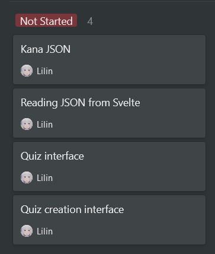

# README

## Organization

See private notion.so. Currently:  


[🔖 Pages](https://kit.svelte.dev/docs#routing-pages)  
SvelteKit docs

## Links

How to import JSON files with SvelteKit?
[👥 SvelteKit JSON Import: use JSON Data in Svelte](https://rodneylab.com/sveltekit-json-import/)  
Rodney Lab

```
  // import root level object as a named import

  import { sponsors } from '$lib/data/clientsSponsors.json';
```

---

How to access local JSON files with svelte?  
[👥 How to access local json file via svelte?](https://stackoverflow.com/a/61652895)  
Stack Overflow answer: [👤 JeffProd](https://stackoverflow.com/users/3207990/jeffprod)

[👥 svelte - reading json file from local folder](https://stackoverflow.com/a/66245679)  
Stack Overflow answer: [👤 Geoff Rich](https://stackoverflow.com/users/14808988/geoff-rich)

How to use rollup plugins with Vite?
[📝 Using Plugins](https://vitejs.dev/guide/using-plugins.html)  
Vite docs

How to do asynchronous things in Svelte?  
[📝 Logic/Await blocks](https://svelte.dev/tutorial/await-blocks)  
Svelte docs
